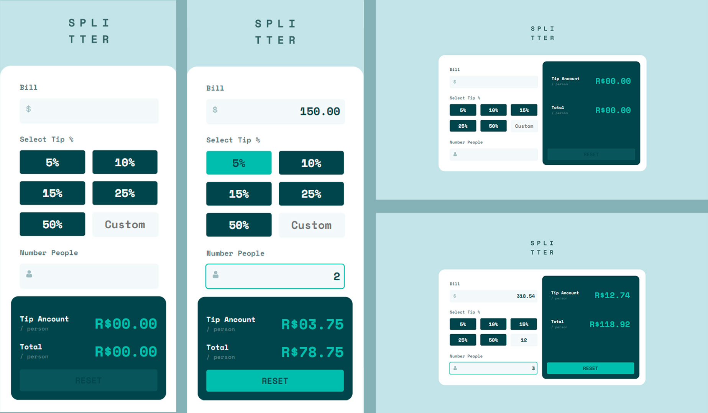

# Frontend Mentor - Tip calculator app solution

This is a solution to the [Tip calculator app challenge on Frontend Mentor](https://www.frontendmentor.io/challenges/tip-calculator-app-ugJNGbJUX). Frontend Mentor challenges help you improve your coding skills by building realistic projects.

## Table of contents

- [Overview](#overview)
  - [The challenge](#the-challenge)
  - [Screenshot](#screenshot)
  - [Links](#links)
- [My process](#my-process)
  - [Built with](#built-with)
  - [What I learned](#what-i-learned)
  - [Continued development](#continued-development)
  - [Useful resources](#useful-resources)
- [Author](#author)

**Note: Delete this note and update the table of contents based on what sections you keep.**

## Overview

### The challenge

Users should be able to:

- View the optimal layout for the app depending on their device's screen size
- See hover states for all interactive elements on the page
- Calculate the correct tip and total cost of the bill per person

### Screenshot



I've separated the screenshots of the two project versions: the mobile version and the desktop version. Each of them includes its standard representation and an interactive version.

### Links

- Solution URL: [https://github.com/gabsiq73/tip-calculator-app](https://github.com/gabsiq73/tip-calculator-app)
- Live Site URL: [https://gabsiq73.github.io/tip-calculator-app/](https://gabsiq73.github.io/tip-calculator-app/)

## My process

### Built with

- Semantic HTML5 markup
- CSS custom properties
- Flexbox
- CSS Grid
- Mobile-first workflow
- JavaScript Vanila

### What I learned

During the execution of this project, I took the opportunity to apply some concepts I was studying. I utilized features such as CSS grid and variables in the root, where I adjusted the project's font-size to 62.5%, making 1rem equivalent to 10px. Additionally, I embraced modularization in JavaScript to enhance the organization of my code.

```css
:root {
    font-size: 62,5%;
    --primary-font: 'Space Mono', sans-serif;

    --primary-color: hsl(172, 67%, 45%);
    --very-dark-cyan: hsl(183, 100%, 15%);
    --dark-grayish-cyan: hsl(186, 14%, 43%);
    --grayish-cyan: hsl(184, 14%, 56%);
    --light-grayish-cyan: hsl(185, 41%, 84%);
    --very-light-grayish-cyan: hsl(189, 41%, 97%);
    --white: hsl(0, 0%, 100%);
}

.tipButtons {
    display: grid;
    grid-template-columns: 1fr 1fr 1fr ;
    column-gap: 1rem;
    row-gap: 1rem;
}
```
```js
// main folder -------------------------
import {
    inputBill,
    inputCustom,
    inputNumberPeople,
    fivePercent,
    tenPercent,
    fifteenPercent,
    twentyFivePercent,
    fiftyPercent,
    resetButton,
    tipAncount,
    total
} from './elements.js'

// elements folder ---------------------
const inputBill = document.querySelector('#bill')
const inputCustom = document.querySelector('#custom')
const inputNumberPeople = document.querySelector('#numberPeople')
const fivePercent = document.querySelector('.fivePercent')
const tenPercent = document.querySelector('.tenPercent')
const fifteenPercent = document.querySelector('.fifteenPercent')
const twentyFivePercent = document.querySelector('.twentyFivePercent')
const fiftyPercent = document.querySelector('.fiftyPercent')
const resetButton = document.querySelector('.resetButton')
const tipAncount = document.querySelector('.tipAncount')
const total = document.querySelector('.valueTotal')

export {
    inputBill,
    inputCustom,
    inputNumberPeople,
    fivePercent,
    tenPercent,
    fifteenPercent,
    twentyFivePercent,
    fiftyPercent,
    resetButton,
    tipAncount,
    total
}
```

### Continued development

These are some areas and skills I plan to dedicate myself to studying in the future, along with some projects I have in mind to undertake.

### Useful resources

- [FunctionFactory] - This resource was crucial in deepening my understanding of data flow in the application. Even though it was a small project, comprehending this aspect is essential for tackling larger projects in the future.
- [Promise] - While this project didn't involve this concept, I acknowledge its importance in web programming and intend to deepen my knowledge of it.


## Author

- Website - [Gabriel Siqueira](https://github.com/gabsiq73)
- Frontend Mentor - [@gabsiq73](https://www.frontendmentor.io/profile/gabsiq73)
- Twitter - [@gabriell_siq](https://twitter.com/gabriell_siq)
